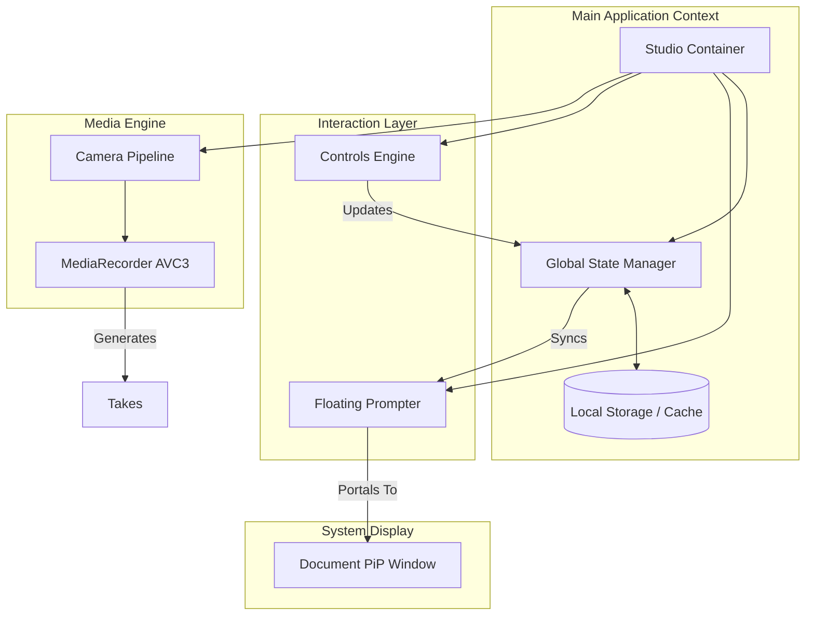

# teleme.me 🎬

A minimalist, high-performance web teleprompter and video recorder. Zero accounts + zero tracking = zero hassle. Everything runs locally in your browser.

## Features

- **Free and Open** 💸: 100% free to use.
- **No Log In** 🔑: Use without an account.
- **High Performance** ✨: Smooth prompter with customizable speed and markdown rendering.
- **Picture-in-Picture** 📺: Pop the prompter into a window to read while using other apps.
- **Pro Recording** 🎥: Download directly as MP4 without watermarks or recording limits.
- **Privacy First** 🔒: No information is sent anywhere. All happens in your device.
- **Localization** 🌍: Translated to 11 languages (English, Español, 日本語, हिन्दी, Français, Deutsch, 中文, العربية, Português, Русский, Polski).

---

## Technical Specification

### Architecture Overview

Teleme.me is built as a highly-decoupled React application that prioritizes layout stability and low-latency interaction.



### Component Breakdown

#### 1. Studio Orchestrator (`Studio.tsx`)
The brain of the operation. It manages the central state for scripts, teleprompter settings, and the collection of video "takes". It acts as the bridge between the media devices (camera/mic) and the display components.

#### 2. Floating Prompter (`FloatingPrompter.tsx`)
A specialized rendering engine for text. It uses the **Document Picture-in-Picture API** to seamlessly transition between an inline element and a floating window. It handles complex layout calculations for smooth scrolling and responsive typography.

#### 3. Controls Engine (`ControlsBar.tsx`)
A context-aware UI layer that provides real-time adjustment of prompter speed, font size, and layout. It features a custom "Spring & Needle" interaction model for speed adjustment, ensuring precise control even during active recordings.

#### 4. Recording Pipeline (`useRecorder.ts`)
A robust wrapper around the `MediaRecorder` API. It utilizes the **AVC3 (avc3.42E01E)** codec profile to ensure that video headers are generated dynamically, preventing file corruption if recording parameters shift.

#### 5. Local Persistence
Utilizes `localStorage` for ephemeral settings (speed, alignment) and browser-based `Blob` storage for video takes, ensuring data remains persistent across session reloads without requiring a server.

---

## Future Features

- **Remote Control**: Scan a QR code with your smartphone to turn it into a wireless remote for the prompter via P2P WebRTC.

---

## Development

### Prerequisites
- Node.js 20+
- `pnpm` 

### Installation
```bash
pnpm install
pnpm run dev
```

This will open a Localhost window. 

> I (stiven.me) built this side project because I was exceedingly frustrated with existing teleprompter applications. They are slow, bloated, require you to log in with an account, pay, and don't support picture-in-picture mode. I build this asking the question 'what does a 10X better teleprompter look like?', and the answer is teleme.me.
>> If you find bugs, [let me know](mailto:strnmrtnz@icloud.com), or open a PR with a video showing what the bug was and how you fixed it. 
