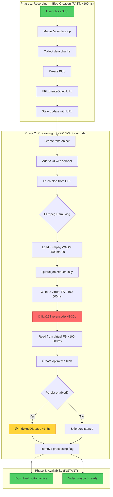
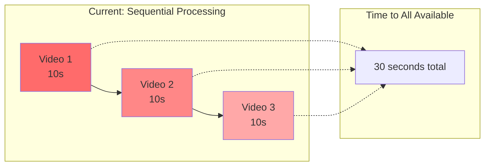
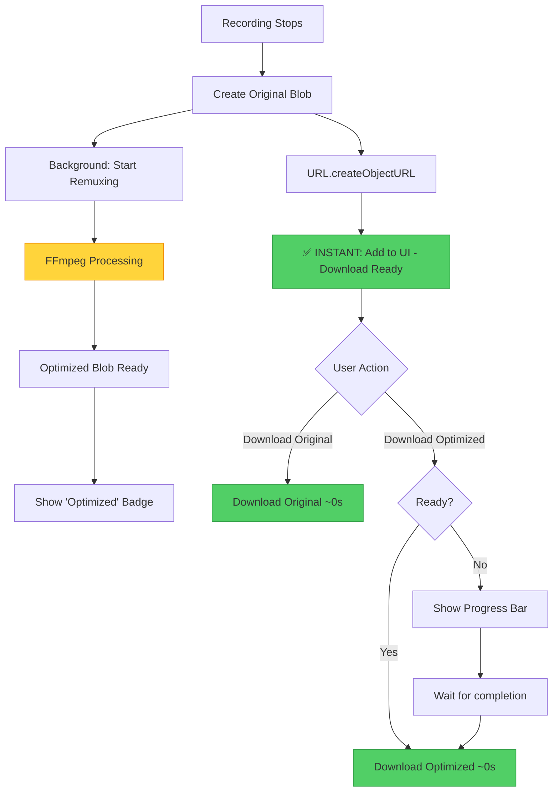
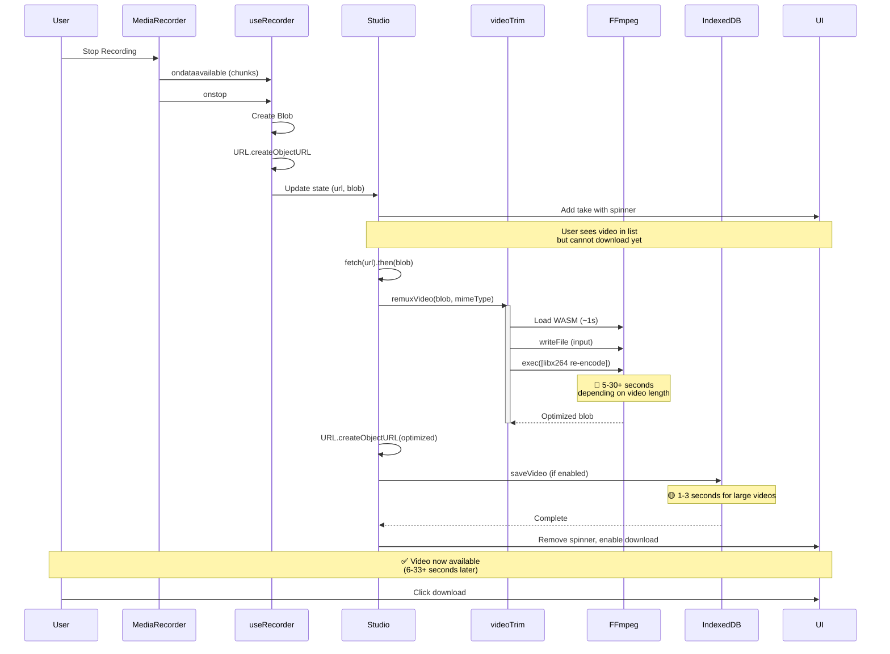
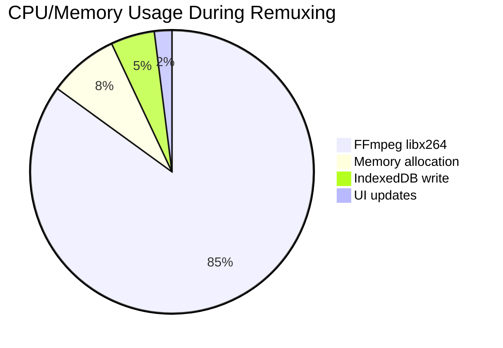
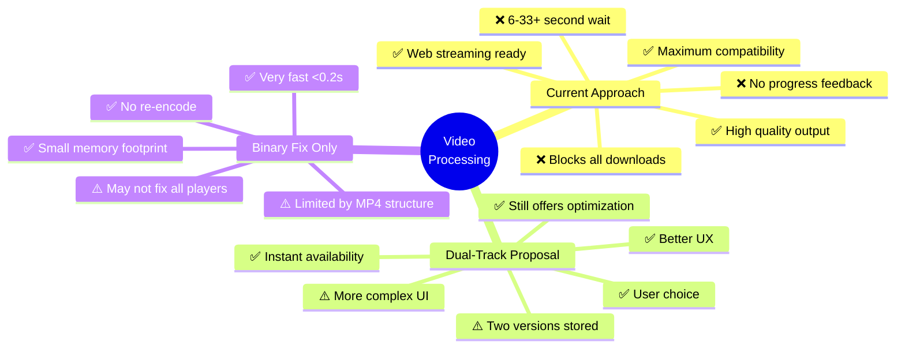

# Video Recording Pipeline Flow Diagram

## Visual Pipeline Overview

## Bottleneck Heatmap

```mermaid
gantt
    title Video Processing Timeline (30-second recording)
    dateFormat X
    axisFormat %Ss

    section Fast
    Blob creation           :done, 0, 100
    Take added to UI        :done, 100, 200

    section Slow
    Fetch blob              :active, 200, 500
    FFmpeg WASM load        :active, 500, 2000
    FS write                :active, 2000, 2500
    libx264 re-encode       :crit, 2500, 19500
    FS read                 :active, 19500, 20000
    IndexedDB save          :crit, 20000, 22000

    section Ready
    Video available         :milestone, 22000, 0
```

## Sequential Queue Impact

## Proposed Solution: Dual-Track Architecture

## Performance Comparison

| Approach | Time to Available | Compatibility | User Experience |
|----------|------------------|---------------|-----------------|
| **Current** | 6-33+ seconds | 🟢 Excellent | 🔴 Poor (long wait) |
| **Original Only** | < 0.1 seconds | 🟡 Good (most players) | 🟢 Excellent (instant) |
| **Dual-Track** | < 0.1 seconds | 🟢 Excellent (both options) | 🟢 Excellent (choice + instant) |
| **Codec Copy** | ~0.5 seconds | 🟡 Good | 🟢 Excellent |
| **Binary Fix Only** | ~0.2 seconds | 🟢 Very Good | 🟢 Excellent |

## Code Flow Sequence

## Resource Utilization During Processing

## Architecture Decision Trade-offs

---

**Note:** All diagrams are Mermaid-compatible and can be rendered in GitHub, VS Code, and most documentation platforms.
